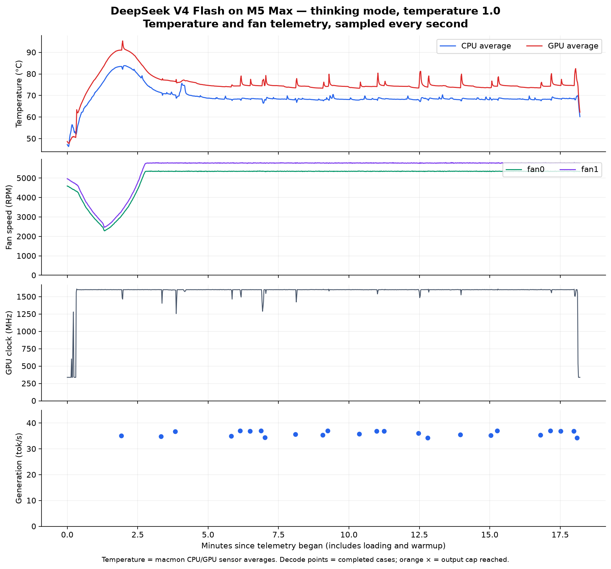

# DeepSeek V4 Flash on the M5 Max: speed, quality, temperature and fans

<!-- AI-ASSISTED-NOTE -->
> [!NOTE]
> This is an AI-assisted research report. Kody directed the work; Codex (OpenAI) prepared the runner, conducted the local measurements, and checked the sources.
<!-- /AI-ASSISTED-NOTE -->

Measured September 22, 2026, on an M5 Max MacBook Pro with 40 GPU cores, 18 CPU cores, 128 GiB unified memory, macOS 26.5, and AC power. This is an interactive desktop host.

**DeepSeek ran locally at 37.3 generation tokens/sec in the three short speed trials.** The thinking-mode pass, using DeepSeek's recommended local sampling temperature, answered **22/24** saved practical cases correctly. It generated at a median **36.0 tok/s**, with a median response time of **29.0 seconds**. The tests and their temperature/fan logger have completed and exited.

## Quality and response speed

| Configuration | Correct | Median generation tok/s | Median response seconds | Incomplete outputs |
|---|---:|---:|---:|---:|
| DeepSeek, thinking off, temperature 0 | 5/24 | 37.28 | 2.175 | 1 |
| DeepSeek, low thinking, temperature 1 | 22/24 | 35.96 | 29.003 | 0 |
| Earlier GPT-OSS 20B MLX, low reasoning, temperature 0 | 20/24 | 131.02 | 3.001 | 0 |

All use the same 24 saved prompts and strict JSON grader. These are three cases each of ledger calculations, event state, dependency scheduling, SQL, shortest paths, extraction, Python tracing, and retrieval. They are **not a general intelligence or software-engineering benchmark**. Temperature, model, tokenizer, conversion, runtime, and cache architecture differ; the table compares observed configurations, not isolated hardware or runtime effects. Generation rates include reasoning and stop tokens reported by the runtime. Smaller models can finish these tasks faster even when decode tok/s alone is similar.

The thinking pass had 1 channel-parsing failure. One SQL response eventually included the correct values, but also emitted an earlier contradictory answer and two closing thinking delimiters. A second SQL response contained the correct values but an extra closing bracket, making its JSON invalid. Both fail the strict screen; manually repaired answers are not counted as passes. See the raw record and [notes](notes.md) for this distinction.

| Saved case category | Chat, temperature 0 | Thinking, temperature 1 |
|---|---:|---:|
| ledger-replay | 0/3 | 3/3 |
| event-state | 0/3 | 3/3 |
| dependency-scheduling | 0/3 | 3/3 |
| sql-analysis | 0/3 | 1/3 |
| shortest-path | 0/3 | 3/3 |
| record-extraction | 2/3 | 3/3 |
| python-trace | 0/3 | 3/3 |
| record-retrieval | 3/3 | 3/3 |

The initial greedy thinking diagnostic repeated fragments on its first case, hit the 8192-token cap, and produced no final answer. That diagnostic is retained separately. DeepSeek's official local guidance recommends temperature 1.0, top_p 1.0 for non-agentic scenarios. The completed thinking pass uses that sampling policy, unrestricted top_k, low effort, seed 42, an 8192-token cap, and a 300-second request limit. This is one sample per case, not an estimate of average accuracy over many seeds. No capped or timed-out output is counted as correct. [Official sampling guidance](https://huggingface.co/deepseek-ai/DeepSeek-V4-Flash-0731#how-to-run-locally), [diagnostic](greedy-thinking-diagnostic/thinking-run.json).

## Short generation and prompt processing

| Measurement | Result |
|---|---:|
| Short generation, median of three trials | 37.33 tok/s |
| Ingest of 7,018-token prompt, median of three trials | 697.46 tok/s |
| Time to first streamed yield for that long prompt, median | 10.11 seconds |
| Peak MLX allocation across speed trials | 86.32 GB |
| Peak MLX allocation across thinking cases | 86.32 GB |

These trials reuse the prior 100-word Rocky Mountains request and repeated-text ingest prompt. The earlier Qwen3-Coder 30B native MLX baseline was 139.68 generation tok/s and 4780.08 ingest tok/s at the same 2048-token prefill step. This is a different model with different quality and memory needs. See the [earlier benchmark](../mac-model-benchmarks/README.md). Prompt timing includes the runtime's initial decode boundary; first-yield latency is a separate wall-clock measurement. Short warmup output is excluded.

## Temperature and fans

Installed **macmon 0.8.2** and verified CPU/GPU temperatures and both fan RPM sensors on this host. The thinking pass has **1082 one-second samples**, including loading, warmup, inference, and cleanup. The original speed/chat run happened before sensor logging and has no temperature trace.

| Sensor | Maximum observed during this monitored window |
|---|---:|
| CPU average temperature | 83.8°C |
| GPU average temperature | 95.3°C |
| Fan 0 | 5373 RPM |
| Fan 1 | 5803 RPM |
| Whole-system memory use | 99.0 GiB |
| Swap used | 0.0 MiB |



Temperatures are macmon's sensor averages, not hottest-die or external calibrated measurements. GPU clocks and power are software-reported estimates. The chart shows the fan response and observed performance together; temperature alone cannot establish thermal throttling, and task length also affects speed. The pass started after an earlier diagnostic, not from a controlled cold state. Monitor overhead was not measured separately. [macmon documentation](https://github.com/vladkens/macmon).

For a live view, run `macmon`. For a ten-minute recording:

```sh
macmon pipe -i 1000 -s 600 > thermal.jsonl
```

The monitoring setup reads sensors. It does not change fan curves or install a startup service. macmon remains installed for future use; the benchmark logger exits with the run.

## Model and runtime

The [mixed 2.4-bit MLX artifact](https://huggingface.co/mlx-community/DeepSeek-V4-Flash-0731-2.4bit-mixed) is pinned to revision `10001e0065f8394e03e968e652cbbe7cd2ca122c`. Its tensors occupy 92.832 decimal GB on disk; all 24 downloaded files were hash-verified. This is aggressive quantization, and the results should not be generalized to DeepSeek's full-precision model.

Inference uses the official oMLX 0.6.4 wheel's model loader and direct MLX-LM generation, MLX 0.32.0, and MLX-LM 0.31.3 at the exact Git revision in [requirements](requirements.txt). Both native indexer kernels were available. Prefill step 2048; fresh architecture-native rotating/compressed caches; no KV quantization, cross-request prompt reuse, or speculative decoding. MTP/DSpark acceleration was not evaluated, so these measurements do not establish the maximum attainable speed. No generated code was executed.

The model remains cached for reuse. The earlier run was stopped at the user's request and resumed with a separate record; historical artifacts were not overwritten. See [notes](notes.md) for the full sequence, exact release checksum, and limitations.

## More models to consider

The earlier shortlist was not exhaustive. **Muse Glimmer 30B, Nemotron 3 Super, Qwen3.5-122B, Devstral Small 2, GLM-4.7-Flash, LFM2-24B, MiniMax M2.7 3-bit, and Granite 4.2 3B** all have relevant roles to evaluate. [The expanded comparison](OTHER-MODELS.md) provides verified weight sizes, primary sources, runtime caveats, and reasons to test each. None of those additional model weights was downloaded for this experiment.

## Saved evidence

- [Chat and speed raw record](chat-and-speed-run.json)
- [Completed thinking raw record](thinking-run.json)
- [Regraded summary and per-case thermal statistics](summary.json)
- [Raw one-second sensor log, gzip](thermal.jsonl.gz)
- [Monitor lifecycle and command](monitor-metadata.json)
- [Hash-verified model manifest](verified.json)
- [Runner](deepseek_replay.py), [monitor wrapper](run_monitored.py), [analysis and chart script](analyze.py)
- [Original chat/speed runner](original_replay.py), [observed-output regression checks](test_replay.py)
- [Candidate revisions and sizes](candidate-metadata.json), [source link checks](source-checks.json)

The scripts use local paths recorded in the notes; pass the research repository and artifact manifest explicitly when replaying. `requirements.txt` is the captured environment, including the local release-wheel path. Reinstall that checksum-verified official wheel to reproduce its environment. To regenerate the summary/plot from this directory, use a Python environment with Matplotlib and run `python analyze.py --repo /path/to/research`.
